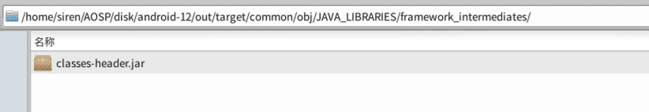
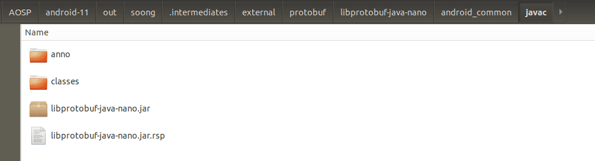
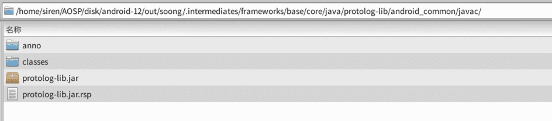
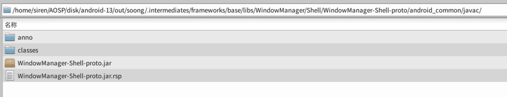
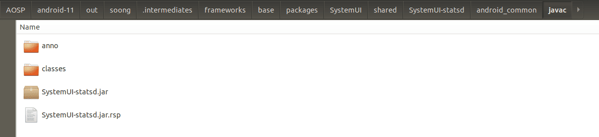
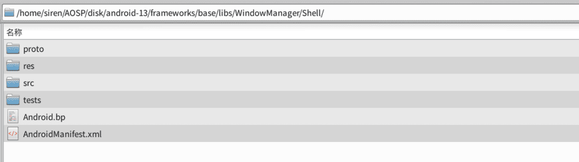
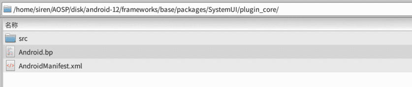
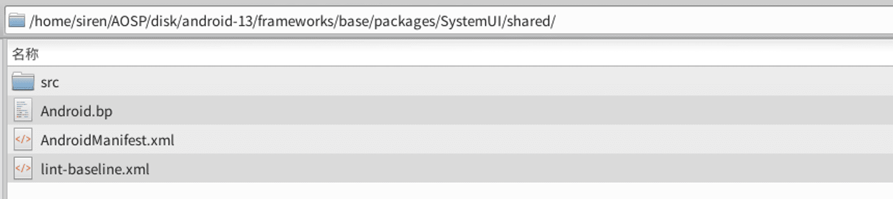

# [English](README.md) | 中文文档
## Launcher3 from android-12.1.0_r11
### Launcher3脱离源码在Android Studio的编译
##### 不同安卓版本的支持请切换到对应的分支
### 支持说明
Google虽然很早就对Launcher3添加了Gradle支持，但是自从Android 12之后，开始撂挑子了，相关脚本代码已经不怎么维护，于是我们试着重新出发，对相关代码做修正，使其可以通过Android Studio进行单独编译。


## 使用命令编译
### 环境依赖
*  Gradle 7.3.3
*  JDK version 11

```
# 构建环境
gradle wrapper

# 打包编译
./gradlew assemble
```

## 在Android Studio上编译
### 推荐使用
*  Android Studio Koala & JDK version 11


### 执行Android Studio上Build APK的操作, 然后将apk推送到设备上Launcher3所在的目录

```
adb push Launcher3QuickStep.apk /system_ext/priv-app/Launcher3QuickStep/

adb shell killall com.android.launcher3
```
#####  首次推送会起不来，需要重启一下设备
```
adb reboot
```

######  另外也支持打包出其他的Flavors版本

## 构建步骤

### Step1：引入静态依赖
##### @framework.jar:
```
// android-12/out/target/common/obj/JAVA_LIBRARIES/framework_intermediates/classes-header.jar
compileOnly files('libs/framework.jar')
```


##### @core-all.jar:
```
// android-12/out/soong/.intermediates/libcore/core-all/android_common/javac/core-all.jar
compileOnly files('libs/core-all.jar')
```


##### @libprotobuf-java-nano.jar:
```
// android-12/out/soong/.intermediates/external/protobuf/libprotobuf-java-nano/android_common/javac/libprotobuf-java-nano.jar
implementation files('libs/libprotobuf-java-nano.jar')
```



##### @protolog-lib.jar:
```
// android-12/out/soong/.intermediates/frameworks/base/core/java/protolog-lib/android_common/javac/protolog-lib.jar
implementation files('libs/protolog-lib.jar')
```


##### @WindowManager-Shell-proto.jar:
```
// android-12/out/soong/.intermediates/frameworks/base/libs/WindowManager/Shell/WindowManager-Shell-proto/android_common/javac/WindowManager-Shell-proto.jar
implementation files('libs/WindowManager-Shell-proto.jar')
```



##### @SystemUI-statsd.jar:
```
// android-12/out/soong/.intermediates/frameworks/base/packages/SystemUI/shared/SystemUI-statsd/android_common/javac/SystemUI-statsd.jar
implementation files('libs/SystemUI-statsd.jar')
```



##### @dynamicanimation-1.1.0-alpha04.aar:
```
// android-12/prebuilts/sdk/current/androidx/m2repository/androidx/dynamicanimation/dynamicanimation/1.1.0-alpha04/dynamicanimation-1.1.0-alpha04.aar
implementation(name: 'dynamicanimation-1.1.0-alpha04', ext: 'aar')
```


###### ps: androidx.dynamicanimation 不容易通过以下方式去引用，故换成静态
```
## implementation 'androidx.dynamicanimation:dynamicanimation:1.1.0-alpha04'
```


### Step2：引入Module
###### 将具体路径下的代码直接导入到项目中作为Module依赖, 构建的时候可以直接通过implementation project引用，或者也可以gradle build生成aar,再放置到libs文件夹中，作为静态包使用。

##### @iconloaderlib: 
```
// android-12/frameworks/libs/systemui/iconloaderlib
implementation project(':iconloaderlib')
```


##### @Shell: 
```
// android-12/frameworks/base/libs/WindowManager/Shell
implementation project(':Shell')
```



##### @plugin_core: 
```
// android-12/frameworks/base/packages/SystemUI/plugin_core
implementation project(':plugin_core')
```



##### @shared: 
```
// android-12/frameworks/base/packages/SystemUI/shared
implementation project(':shared')
```



## 生成platform.keystore默认签名

在AOSP/android-12/build/target/product/security路径下找到签名证书，并使用 [keytool-importkeypair](https://github.com/getfatday/keytool-importkeypair) 生成keystore,
执行如下命令：

```
./keytool-importkeypair -k platform.keystore -p 123456 -pk8 platform.pk8 -cert platform.x509.pem -alias platform
```

并将以下代码添加到gradle配置中：

```
    signingConfigs {
        platform {
            storeFile file("platform.keystore")
            storePassword '123456'
            keyAlias 'platform'
            keyPassword '123456'
        }
    }

    buildTypes {
        release {
            debuggable false
            minifyEnabled false
            signingConfig signingConfigs.platform
        }

        debug {
            debuggable true
            minifyEnabled false
            signingConfig signingConfigs.platform
        }
    }
```

### 关联项目
* [Settings](https://github.com/siren-ocean/Settings)
* [Launcher3](https://github.com/siren-ocean/Launcher3)
* [DocumentsUI](https://github.com/siren-ocean/DocumentsUI)
* [Camera2](https://github.com/siren-ocean/Camera2)
* [PermissionController](https://github.com/siren-ocean/PermissionController)