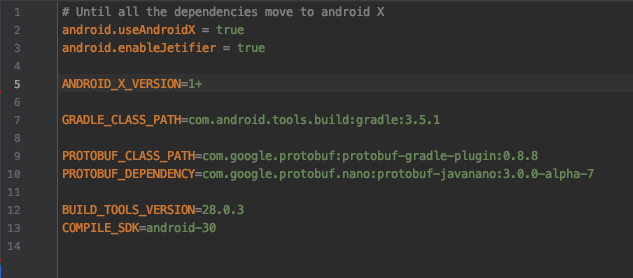
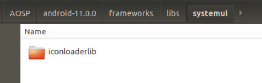
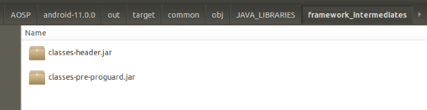
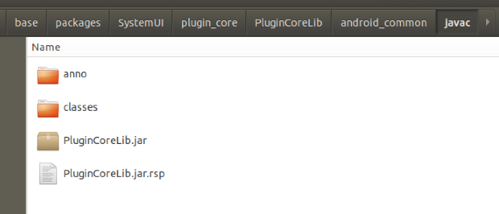
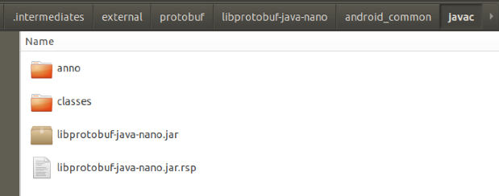
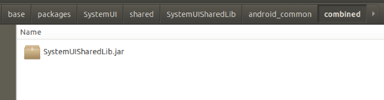
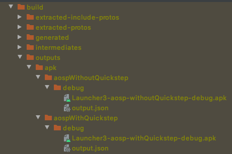

# Launcher3 from android-11.0.0_r38

### 由于Android11之后，SystemUI删除了多任务键功能，相关的工作已经由Launcher3的quickstep来实现，所以记录下Launcher3的整个项目在Android Studio上的配置工作。 

---

### Step1:  
在gradle.properties的配置文件中  
修改COMPILE_SDK=android-R 为 COMPILE_SDK=android-30  


---
### Step2:  
从frameworks/lib/systemui/目录下，引入iconloaderlib，拷贝的Launcher3根目录下



---

### Step3:  
从out/target/common/obj/JAVA_LIBRARIES/framework_intermediates/路径下  
拷贝classes.jar，两者选其一，并更改为framework.jar，引入到libs目录下  



gradle路径下添加如下配置：

```
dependencies{
	compileOnly files('libs/framework.jar')
	……
}

```

```
allprojects {
    repositories {
    	……
        mavenCentral()
        google()
    }
    gradle.projectsEvaluated { tasks.withType(JavaCompile) { options.compilerArgs << '-Xbootclasspath/p:libs/framework.jar' } }
}
```

移除gradle配置下的recyclerview和preference的androidx.core:core依赖

```
……
implementation("androidx.recyclerview:recyclerview:${ANDROID_X_VERSION}") {
        exclude group: 'androidx.core', module: 'core'
    }
    implementation("androidx.preference:preference:${ANDROID_X_VERSION}") {
        exclude group: 'androidx.core', module: 'core'
    }
……
```
并指定iconloaderlib下的gradle配置下的androidx.core:core版本为1.6.0

```
dependencies {
    implementation "androidx.core:core:1.6.0"
}
```

---

### Step4:  
在目录/out/soong/.intermediates/frameworks/base/packages/SystemUI/plugin_core/PluginCoreLib/android_common/javac下  
拷贝PluginCoreLib.jar并引入到libs  



并修改gradle配置：

```
withoutQuickstepImplementation fileTree(dir: "${FRAMEWORK_PREBUILTS_DIR}/libs", include: 'plugin_core.jar')
```

为

```
withoutQuickstepImplementation files("libs/PluginCoreLib.jar")
```
---

### Step5:  
在目录/out/soong/.intermediates/external/protobuf/libprotobuf-java-nano/android_common/javac/下  
拷贝libprotobuf-java-nano.jar并引入到libs



修改gradle配置：


```
implementation fileTree(dir: "${FRAMEWORK_PREBUILTS_DIR}/libs", include: 'launcher_protos.jar')
```

为

```
implementation files("libs/libprotobuf-java-nano.jar")

```
---


### Step6:  
在目录/out/soong/.intermediates/frameworks/base/packages/SystemUI/shared/SystemUISharedLib/android_common/combined下  
拷贝SystemUISharedLib.jar并引入到libs  



修改gradle配置  

```
withQuickstepImplementation project(':SharedLibWrapper')
```

为

```
withQuickstepImplementation files("libs/SystemUISharedLib.jar")

```
---

### Step7:  
注释掉以下类报红的日志代码：   
Launcher  
Workspace  
UseEventDispatcher  
ItemInfo  
FolderInfo  
Folder  
LauncherAppWidgetInfo  
StatsLogManager  
AbstractStateChangeTouchController  
NoButtonQuickSwitchTouchController  
OverviewWithoutFocusInputConsumer 
HotseatPredictionController
NavBarToHomeTouchController 
BaseSwipeUpHandlerV2  
UserEventDispatcher  

删除以下类：  
StatsLogCompatManager

---

### Step8:  
在build/target/product/security目录下，使用工具生成testkey.keystore  
推荐：https://github.com/getfatday/keytool-importkeypair  
操作：./keytool-importkeypair -k testkey.keystore -p 123456 -pk8 testkey.pk8 -cert testkey.x509.pem -alias testkey  
将以下代码添加到gradle配置：

```
    signingConfigs {
        testkey {
            storeFile file("testkey.keystore")
            storePassword '123456'
            keyAlias 'testkey'
            keyPassword '123456'
        }
    }

    buildTypes {
        debug {
            minifyEnabled false
            signingConfig signingConfigs.testkey
        }
    }
```

---

### Step9:  
编译并打包结果：  


