# English | [中文文档](README.cn.md)
## Launcher3 from android-14.0.0_r67
### Building Launcher3 outside AOSP source in Android Studio
##### Please switch to the corresponding branch for different Android version support
### Support Notes
* Although Google added Gradle support to Launcher3 early on, since Android 12, they have stopped maintaining it. The related script code is no longer well maintained. We have tried to start fresh and made corrections to the related code so that it can be compiled separately in Android Studio.  
* Starting from Android 14, Launcher3 began to reference some private resources from the system internally, which cannot be recognized by Android Studio's SDK toolchain and need to be temporarily replaced using scripts.

## Building with Command Line
### Environment Requirements
*  Gradle 8.7
*  JDK version 17

```
# Setup build environment
gradle wrapper

# Execute pre-filter task
./gradlew :Filter:run

# Build and package
./gradlew assemble
```


## Building in Android Studio
### Recommended
*  Android Studio Koala & JDK version 17

#### Step 1: Run the main function on Filter to execute filter tasks
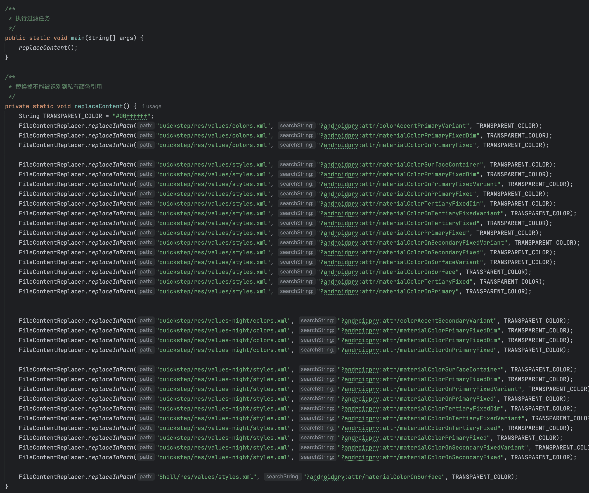

*  Remove some color attributes not supported by AS


### Step 2: Execute Build APK in Android Studio, then push the apk to the Launcher3 directory on the device

```
adb push Launcher3QuickStep.apk /system_ext/priv-app/Launcher3QuickStep/

adb shell killall com.android.launcher3
```
#####  The first push may not start properly, you need to reboot the device.
```
adb reboot
```

######  Other Flavors versions are also supported

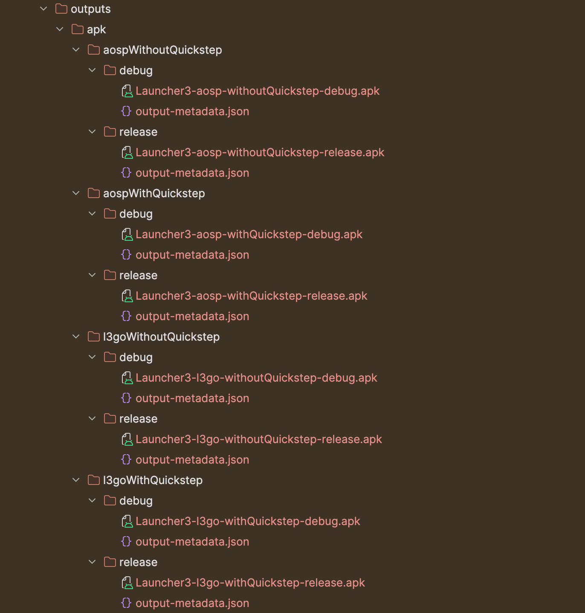

## Build Steps

### Step 1: Add Static Dependencies
##### @framework.jar:
```
// android-14/out/target/common/obj/JAVA_LIBRARIES/framework_intermediates/classes-header.jar
compileOnly files('libs/framework.jar')
```


##### @core-all.jar:
```
// android-14/out/soong/.intermediates/libcore/core-all/android_common/javac/core-all.jar
compileOnly files('libs/core-all.jar')
```


##### @libprotobuf-java-nano.jar:
```
// android-14/out/soong/.intermediates/external/protobuf/libprotobuf-java-nano/android_common/javac/libprotobuf-java-nano.jar
implementation files('libs/libprotobuf-java-nano.jar')
```


##### @WindowManager-Shell-proto.jar:
```
// android-14/out/soong/.intermediates/frameworks/base/libs/WindowManager/Shell/WindowManager-Shell-proto/android_common/e18b8e8d84cb9f664aa09a397b08c165/javac/WindowManager-Shell-proto.jar
implementation files('libs/WindowManager-Shell-proto.jar')
```


##### @WindowManager-Shell-shared.jar:
```
// android-14/out/soong/.intermediates/frameworks/base/libs/WindowManager/Shell/WindowManager-Shell-shared/android_common/e18b8e8d84cb9f664aa09a397b08c165/javac/WindowManager-Shell-shared.jar
implementation files('libs/WindowManager-Shell-shared.jar')
```


##### @SystemUI-statsd.jar:
```
// android-14/out/soong/.intermediates/frameworks/base/packages/SystemUI/shared/SystemUI-statsd/android_common/e18b8e8d84cb9f664aa09a397b08c165/javac/SystemUI-statsd.jar
implementation files('libs/SystemUI-statsd.jar')
```


##### @com.android.window.flags.window-aconfig-java.jar:
```
// android-14/out/soong/.intermediates/frameworks/base/com.android.window.flags.window-aconfig-java/android_common/javac/com.android.window.flags.window-aconfig-java.jar
implementation files('com.android.window.flags.window-aconfig-java.jar')
```
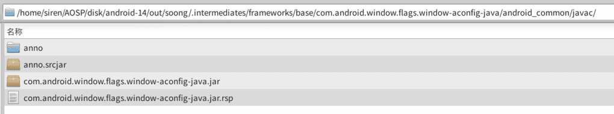

##### @com_android_systemui_flags_lib.jar:
```
// android-14/out/soong/.intermediates/frameworks/base/packages/SystemUI/aconfig/com_android_systemui_flags_lib/android_common/e18b8e8d84cb9f664aa09a397b08c165/javac/com_android_systemui_flags_lib.jar
implementation files('com_android_systemui_flags_lib.jar')
```
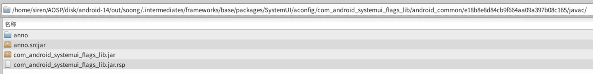


##### @com_android_systemui_shared_flags_lib.jar:
```
// android-14/out/soong/.intermediates/frameworks/libs/systemui/aconfig/com_android_systemui_shared_flags_lib/android_common/e18b8e8d84cb9f664aa09a397b08c165/javac/com_android_systemui_shared_flags_lib.jar
implementation files('com_android_systemui_shared_flags_lib.jar')
```


##### @com_android_wm_shell_flags_lib.jar:
```
// android-14/out/soong/.intermediates/frameworks/base/libs/WindowManager/Shell/aconfig/com_android_wm_shell_flags_lib/android_common/e18b8e8d84cb9f664aa09a397b08c165/javac/com_android_wm_shell_flags_lib.jar
implementation files('com_android_wm_shell_flags_lib.jar')
```


##### @com_android_launcher3_flags_lib.jar:
```
// android-14/out/soong/.intermediates/packages/apps/Launcher3/aconfig/com_android_launcher3_flags_lib/android_common/e18b8e8d84cb9f664aa09a397b08c165/javac/com_android_launcher3_flags_lib.jar
implementation files('com_android_launcher3_flags_lib.jar')
```
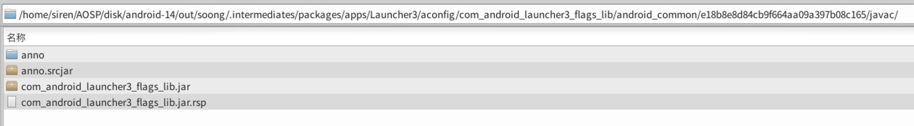


##### @perfetto_trace_java_protos.jar:
```
// android-14/out/soong/.intermediates/external/perfetto/perfetto_trace_java_protos/android_common/e18b8e8d84cb9f664aa09a397b08c165/javac/perfetto_trace_java_protos.jar
implementation files('libs/perfetto_trace_java_protos.jar')
```
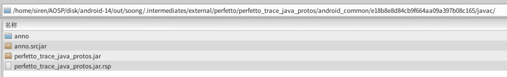

##### @launcher-testing-shared.jar:
```
// android-14/out/soong/.intermediates/packages/apps/Launcher3/tests/launcher-testing-shared/android_common/javac/launcher-testing-shared.jar
implementation files('libs/launcher-testing-shared.jar')
```
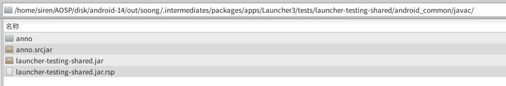

##### @tracinglib-platform.jar:
```
// android-14/out/soong/.intermediates/frameworks/libs/systemui/tracinglib/tracinglib-platform/android_common/e18b8e8d84cb9f664aa09a397b08c165/kotlin/tracinglib-platform.jar
implementation files('libs/tracinglib-platform.jar')
```


### Step 2: Add Module Dependencies
###### Import code from specific paths directly into the project as Module dependencies. You can reference them through implementation project during build, or build aar with gradle build and place it in the libs folder.

##### @iconloaderlib: 
```
// android-14/frameworks/libs/systemui/iconloaderlib
implementation project(':iconloaderlib')
```


##### @animationlib: 
```
// android-14/frameworks/libs/systemui/animationlib  
implementation project(':animationlib')
```
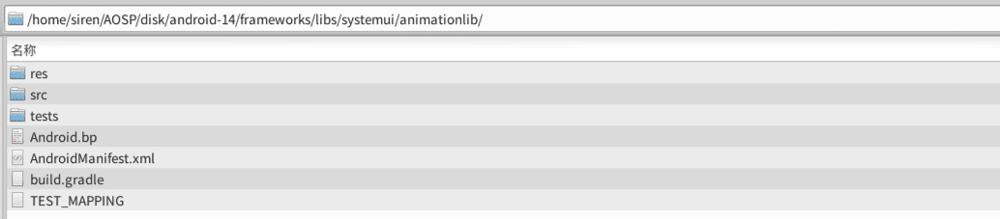

##### @viewcapturelib: 
```
// android-14/frameworks/libs/systemui/viewcapturelib  
implementation project(':viewcapturelib')
```


##### @Shell: 
```
// android-14/frameworks/base/libs/WindowManager/Shell
implementation project(':Shell')
```


##### @plugin: 
```
// android-14/frameworks/base/packages/SystemUI/plugin
implementation project(':plugin')
```
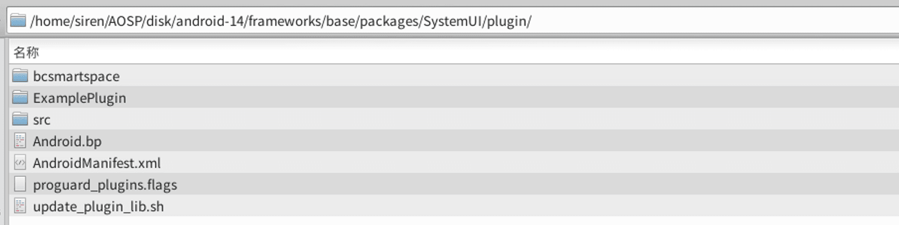

##### @plugin_core: 
```
// android-14/frameworks/base/packages/SystemUI/plugin_core
implementation project(':plugin_core')
```


##### @shared: 
```
// android-14/frameworks/base/packages/SystemUI/shared
implementation project(':shared')
```


##### @animation: 
```
// android-14/frameworks/base/packages/SystemUI/animation
implementation project(':animation')
```
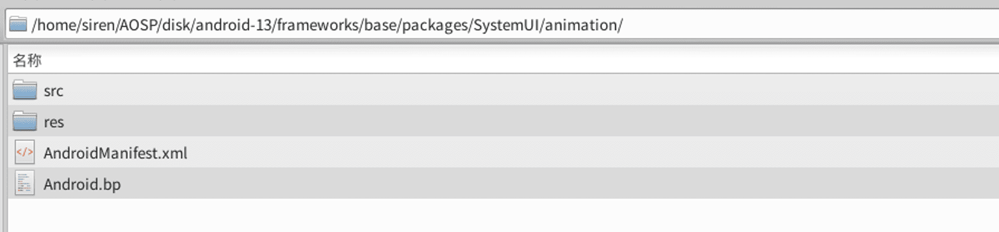

##### @unfold: 
```
// android-14/frameworks/base/packages/SystemUI/unfold
implementation project(':unfold')
```
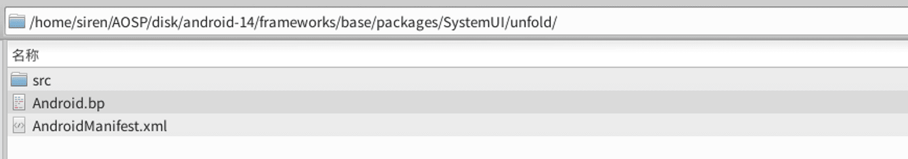

##### @common: 
```
// android-14/frameworks/base/packages/SystemUI/common
implementation project(':common')
```
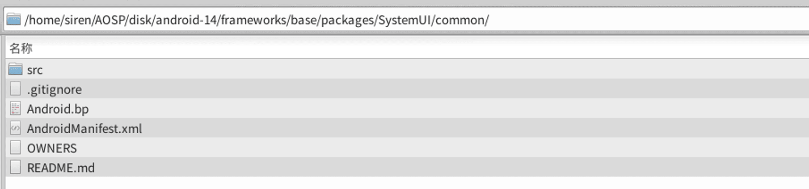

##### @log: 
```
// android-14/frameworks/base/packages/SystemUI/log
implementation project(':log')
```
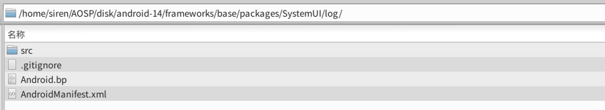

##### @SettingsTheme: 
```
// android-14/frameworks/base/packages/SettingsLib/SettingsTheme
implementation project(':SettingsTheme')
```
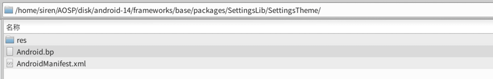

## Generate platform.keystore Default Signature

Find the signing certificates in the AOSP/android-14/build/target/product/security path and use [keytool-importkeypair](https://github.com/getfatday/keytool-importkeypair) to generate the keystore.
Execute the following command:

```
./keytool-importkeypair -k platform.keystore -p 123456 -pk8 platform.pk8 -cert platform.x509.pem -alias platform
```

And add the following code to the gradle configuration:

```
    signingConfigs {
        platform {
            storeFile file("platform.keystore")
            storePassword '123456'
            keyAlias 'platform'
            keyPassword '123456'
        }
    }

    buildTypes {
        release {
            debuggable false
            minifyEnabled false
            signingConfig signingConfigs.platform
        }

        debug {
            debuggable true
            minifyEnabled false
            signingConfig signingConfigs.platform
        }
    }
```
### PS:
##### View ignored file list
```
git ls-files -v | grep '^h\ '
```  

##### Ignore and restore a single file
``` 
git update-index --assume-unchanged $path
git update-index --no-assume-unchanged $path
``` 

##### Restore all ignored files
```
git ls-files -v | grep '^h' | awk '{print $2}' |xargs git update-index --no-assume-unchanged 
```

### Related Projects
* [Settings](https://github.com/siren-ocean/Settings)
* [Launcher3](https://github.com/siren-ocean/Launcher3)
* [DocumentsUI](https://github.com/siren-ocean/DocumentsUI)
* [Camera2](https://github.com/siren-ocean/Camera2)
* [PermissionController](https://github.com/siren-ocean/PermissionController)

