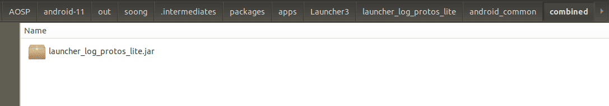
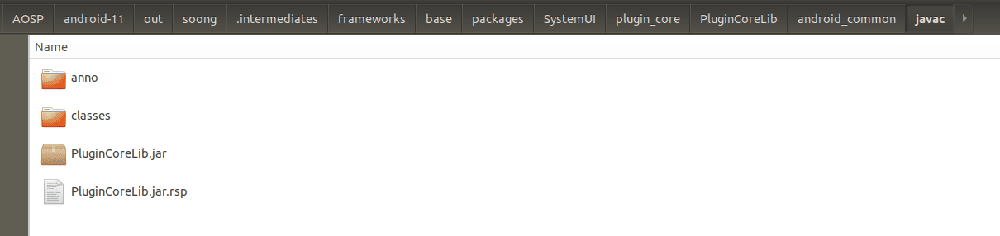
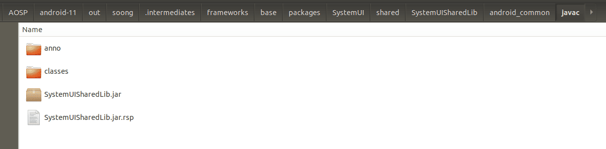

## Launcher3 from android-11.0.0_r38
### Launcher3脱离源码在Android Studio的编译

#### 由于Android11之后，SystemUI删除了多任务键功能，相关的工作已经由Launcher3的quickstep来实现，所以记录下Launcher3的整个项目在Android Studio上的配置工作。

### 支持说明
* 添加额外的配置和依赖构建Gradle环境支持
* 仅改动一个地方，即注释了一处废弃代码，使项目可以被运行起来，其他内容将和原始仓库一样保持不变


```
@PATH: src/com/android/launcher3/model/data/ItemInfo.java
*********************************************************

// import com.android.launcher3.logger.LauncherAtom.TaskForegroundContainer;

*********************************************************
// case CONTAINER_TASKFOREGROUND:
//     return ContainerInfo.newBuilder()
//             .setTaskForegroundContainer(TaskForegroundContainer.getDefaultInstance())
//             .build();

```

## 使用命令编译
### 环境依赖
*  Gradle 6.5
*  JDK version >= 8

```
# 构建环境
gradle wrapper

# 打包编译
./gradlew assemble
```


## 使用Android Studio编译

### 执行Android Studio上Build APK的操作, 然后将apk推送到设备上Launcher3所在的目录

```
adb push Launcher3QuickStep.apk /system/system_ext/priv-app/Launcher3QuickStep/Launcher3QuickStep.apk

adb shell killall com.android.launcher3
```
######  首次推送会起不来，需要重启一下设备
```
adb reboot
```

######  也可以直接安装
```
adb install Launcher3QuickStep.apk

```

######  另外也支持打包出其他的Flavors版本


## 构建步骤

### Step1：引入静态依赖
##### @framework.jar:
```
// AOSP/android-11/out/target/common/obj/JAVA_LIBRARIES/framework_intermediates/classes-header.jar
compileOnly files('libs/framework.jar')
```


##### @launcher_log_protos_lite.jar:
```
// AOSP/android-11/out/soong/.intermediates/packages/apps/Launcher3/launcher_log_protos_lite/android_common/combined/launcher_log_protos_lite.jar
implementation files("libs/launcher_log_protos_lite.jar")
```


##### @libprotobuf-java-nano.jar:
```
// AOSP/android-11/out/soong/.intermediates/external/protobuf/libprotobuf-java-nano/android_common/javac/libprotobuf-java-nano.jar
implementation files("libs/libprotobuf-java-nano.jar")
```


##### @PluginCoreLib.jar:
```
// AOSP/android-11/out/soong/.intermediates/frameworks/base/packages/SystemUI/plugin_core/PluginCoreLib/android_common/javac/PluginCoreLib.jar
implementation files("libs/PluginCoreLib.jar")
```


##### @SystemUI-statsd.jar:
```
// AOSP/android-11/out/soong/.intermediates/frameworks/base/packages/SystemUI/shared/SystemUI-statsd/android_common/javac/SystemUI-statsd.jar
implementation files("libs/SystemUI-statsd.jar")
```


##### @SystemUISharedLib.jar:
```
// AOSP/android-11/out/soong/.intermediates/frameworks/base/packages/SystemUI/shared/SystemUISharedLib/android_common/javac/SystemUISharedLib.jar
implementation files("libs/SystemUISharedLib.jar")
```



### Step2：引入Module
##### 将具体路径下的代码直接导入到项目中作为Module依赖, 构建的时候可以直接通过implementation project引用，或者也可以gradle build生成aar,再放置到libs文件夹中，作为静态包使用。

##### @iconloaderlib: 
```
// AOSP/android-11/frameworks/libs/systemui/iconloaderlib
implementation project(':IconLoader')
```


## 生成签名

在AOSP/android-11/build/target/product/security目录下，使用 [keytool-importkeypair](https://github.com/getfatday/keytool-importkeypair) 生成keystore

```
./keytool-importkeypair -k testkey.keystore -p 123456 -pk8 testkey.pk8 -cert testkey.x509.pem -alias testkey  
```

将以下代码添加到gradle配置：

```
    signingConfigs {
        testkey {
            storeFile file("testkey.keystore")
            storePassword '123456'
            keyAlias 'testkey'
            keyPassword '123456'
        }
    }

    buildTypes {
        debug {
            minifyEnabled false
            signingConfig signingConfigs.testkey
        }
    }
```

---

### 关联项目
* [Settings](https://github.com/siren-ocean/Settings)
* [SystemUI](https://github.com/siren-ocean/SystemUI)
* [Launcher3](https://github.com/siren-ocean/Launcher3)
* [Camera2](https://github.com/siren-ocean/Camera2)
* [PermissionController](https://github.com/siren-ocean/PermissionController)
